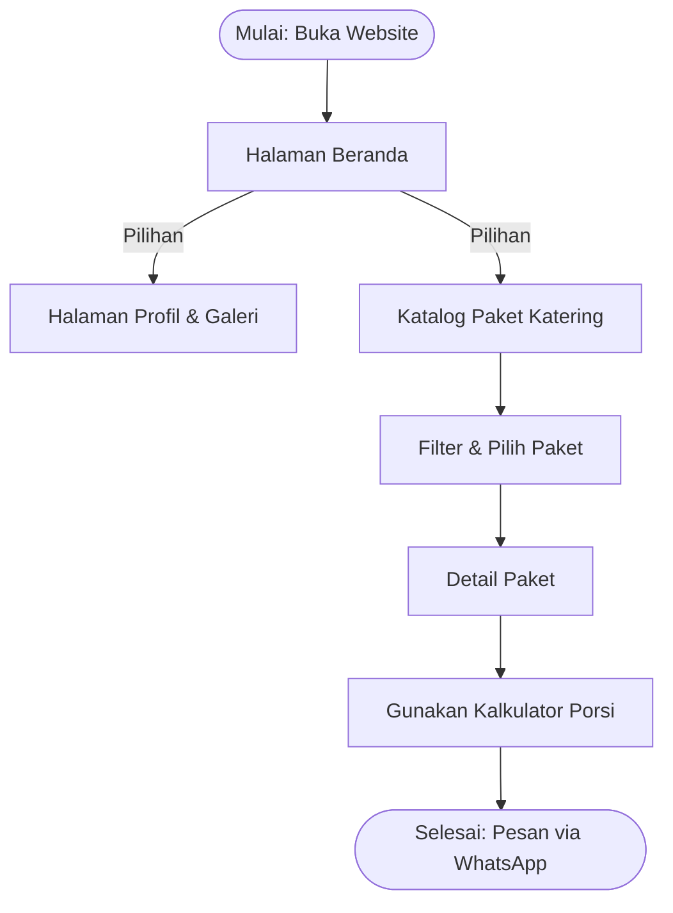
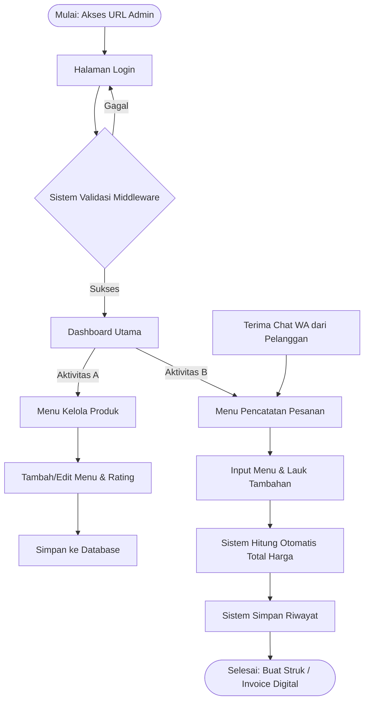

# Architecture — Catering Nusantara

> Dokumen ini menjelaskan struktur sitemap, userflow, dan skema database untuk proyek Catering Nusantara (Dapur Bunda Catering). Ditulis agar developer maupun AI coding agent (OpenCode) punya konteks penuh sebelum menulis kode.

---

## 1. Ringkasan Arsitektur

Sistem ini terdiri dari dua permukaan yang berbagi satu database:

- **Public Site** — read-only terhadap `paket` dan `galeri`, tanpa autentikasi, tujuan utamanya konversi ke chat WhatsApp.
- **Admin CMS + Mini POS** — di balik middleware autentikasi, satu-satunya permukaan yang menulis ke `pesanan`.

Skema database (V3) **tidak berubah secara struktural** pada revisi ini — tetap 4 tabel inti (`users`, `paket`, `galeri`, `pesanan`). Yang bertambah pada revisi ini adalah **cakupan halaman publik** (berdasarkan sheet "Struktur Menu Website") dan **tech stack front-end/back-end**, bukan tabel baru. Ini dicatat secara eksplisit di sini supaya AI agent tidak berasumsi ada migrasi baru yang perlu dibuat tanpa instruksi lebih lanjut.

---

## 2. Sitemap & Prioritas Halaman

Diambil langsung dari data client (sheet "Struktur Menu Website"):

| # | Halaman | Sub-menu | Isi Utama | Sumber Data | Prioritas |
|---|---|---|---|---|---|
| 1 | Beranda | – | Banner + tagline, best-seller, ringkasan keunggulan, testimoni, CTA | Profil Usaha, Data Produk | **Wajib** |
| 2 | Tentang Kami | – | Sejarah usaha, visi & misi, value proposition, foto dapur/tim | Profil Usaha | **Wajib** |
| 3 | Paket Katering | Filter: Kategori Paket, Kategori Acara, Rentang Harga | Grid/card seluruh paket, bisa difilter | Data Produk | **Wajib** |
| 3.1 | Detail Paket | – | Foto besar, harga per porsi, menu utama & tambahan, min. order, CTA WA | Data Produk | **Wajib** |
| 4 | Galeri Acara | – | Dokumentasi foto acara sebelumnya | Profil Usaha | Opsional |
| 5 | Testimoni | – | Ulasan pelanggan + rating bintang | Profil Usaha | Opsional |
| 6 | Cara Pemesanan | – | Alur pesan → chat WA → konfirmasi → DP → H-1 konfirmasi ulang | Kebutuhan Website | **Wajib** |
| 7 | Kontak | – | Alamat, HP/WA, email, sosial media, peta lokasi, form kontak | Profil Usaha | **Wajib** |
| 8 | FAQ | – | Pertanyaan umum (min. order, request menu khusus, area kirim, H- booking) | Kebutuhan Website | Opsional |
| 9 | Dashboard (Admin) | – | Total menu, total kategori, ringkasan lauk | Sistem (agregat `paket`) | Opsional (dianggap wajib untuk POS berjalan) |
| 10 | Login (Admin) | – | Autentikasi middleware | Sistem (`users`) | Opsional (wajib secara teknis) |
| 11 | Kelola Data Produk | CRUD penuh | Tambah/update/hapus menu, kelola rating paket | `paket` | Opsional (wajib secara teknis) |
| 12 | Pencatatan & Perhitungan Pesanan (Admin) | Hitung total harga paket + lauk | Input pesanan → kalkulasi otomatis → struk → riwayat | `pesanan` | Opsional (wajib secara teknis) |

> Catatan: halaman 9–12 ditandai "Opsional" oleh klien di spreadsheet, tetapi secara arsitektur ini justru fondasi dari Mini POS yang menjadi nilai jual utama proposal — perlakukan sebagai **wajib untuk MVP admin**, bukan nice-to-have.

**Halaman baru dibanding revisi sebelumnya:** Tentang Kami, Cara Pemesanan, Kontak (dengan peta), dan FAQ eksplisit muncul sebagai halaman publik terpisah — sebelumnya hanya tersirat dalam alur "Beranda → Katalog → Detail → Kalkulator → WA".

---

## 3. Userflow

### 3.1 Alur Pelanggan (Role 1)



Catatan implementasi: diagram sumber (`UMKM_Userflow.mmd`) belum menggambarkan node terpisah untuk Tentang Kami, Cara Pemesanan, Kontak, dan FAQ — namun keempatnya **wajib ada sebagai halaman statis/informational** yang bisa diakses dari navigasi utama, di luar jalur konversi linear di atas. Jangan hapus jalur konversi inti (Katalog → Detail → Kalkulator → WA) demi menambahkan halaman-halaman ini; keduanya hidup berdampingan.

### 3.2 Alur Admin (Role 2)



Transisi kritis tetap sama seperti versi sebelumnya: output alur pelanggan (pesan WA dengan detail paket + estimasi harga) menjadi **input manual** ke Aktivitas B di sisi admin. Sistem tidak menggantikan WhatsApp sebagai kanal penjualan — sistem menghilangkan aritmetika manual dan pencatatan manual di sekitar kanal itu.

---

## 4. Skema Database (ERD)

Tidak ada tabel baru pada revisi ini. Skema tetap:

```dbml
Table users {
  id int [pk, increment]
  nama varchar [not null]
  email varchar [unique, not null]
  password varchar [not null]
  role varchar [default: 'admin']
  created_at timestamp
  updated_at timestamp
}

Table paket {
  id int [pk, increment]
  nama_paket varchar [not null]
  kategori_paket varchar [not null]       // Nasi Box, Prasmanan, Snack, Tumpeng
  kategori_acara varchar                   // Pernikahan, Kantor, Ulang Tahun, Arisan, Umum
  menu_utama json
  menu_tambahan json
  fasilitas_termasuk json
  catatan_alergen text
  jenis_kemasan varchar
  min_order int [default: 1]
  harga_per_porsi decimal(12,2) [not null]
  kapasitas_produksi int
  deskripsi text
  gambar varchar
  is_best_seller boolean [default: false]
  created_at timestamp
  updated_at timestamp
}

Table galeri {
  id int [pk, increment]
  nama_acara varchar [not null]
  deskripsi_acara text
  gambar_acara varchar [not null]
  tanggal_acara date
  created_at timestamp
  updated_at timestamp
}

Table pesanan {
  id int [pk, increment]
  nomor_struk varchar [unique, not null]   // STR-YYYYMMDD-XXXX
  nama_pemesan varchar [not null]
  no_telepon varchar [not null]
  paket_id int [ref: > paket.id, not null]
  jumlah_paket int [not null]
  harga_paket_satuan decimal(12,2) [not null]  // snapshot harga saat order dibuat
  detail_tambahan json
  biaya_tambahan decimal(12,2) [default: 0]
  catatan text
  total_harga decimal(12,2) [not null]
  status_pesanan varchar [default: 'pending']
  created_at timestamp
  updated_at timestamp
}
```

### 4.1 Validasi terhadap Data Riil Klien

Data produk riil klien (sheet "Data Produk") mengonfirmasi bahwa skema ini sudah cukup fleksibel tanpa perubahan:

- Rentang harga per porsi: Rp18.000 (Snack Box) s.d. Rp250.000 per paket 10 porsi (Tumpeng Mini) — kolom `harga_per_porsi` sebagai `decimal(12,2)` menampung ini tanpa masalah. **Perhatian khusus:** Paket Tumpeng Mini dihargai per paket (10 porsi), bukan per porsi individual — pastikan `harga_per_porsi` di tabel diisi hasil bagi (Rp25.000/porsi), dan biarkan `min_order` (10) yang membawa makna "per paket". Jangan simpan angka Rp250.000 mentah sebagai `harga_per_porsi`, karena akan merusak kalkulasi `total_harga` di `pesanan`.
- Variasi kategori (Nasi Box, Prasmanan, Snack, Tumpeng) dan kategori acara (Pernikahan, Kantor, Ulang Tahun, Arisan, Umum) — sudah tertampung di `kategori_paket` dan `kategori_acara` sebagai string bebas, cukup untuk filter.
- Kapasitas produksi bervariasi (20 paket s.d. 1000 porsi) — kolom `kapasitas_produksi` sudah ada, gunakan untuk validasi stok/kapasitas saat admin menerima pesanan besar.

### 4.2 JSON Arrays vs. Junction Tables (tetap berlaku)

Keputusan menyimpan `menu_utama`, `menu_tambahan`, `fasilitas_termasuk`, dan `detail_tambahan` sebagai JSON — bukan tabel junction — tetap menjadi keputusan yang tepat untuk skala UMKM ini:

| Kriteria | Junction Table | JSON Column (dipakai) |
|---|---|---|
| Kompleksitas query katalog | Perlu banyak join per kartu paket | Satu baris, tanpa join |
| Kompleksitas tulis saat admin edit | Transaksi multi-tabel | Satu `UPDATE` |
| Fleksibilitas skema | Perlu migrasi untuk atribut baru | Tinggal tambah key baru |
| Kebutuhan query lintas paket | Tidak relevan di user flow ini | Tidak dibutuhkan sama sekali |

Tidak ada kebutuhan nyata untuk query lintas-paket (misalnya "cari semua paket yang mengandung Rendang") di sitemap manapun — jadi normalisasi penuh justru over-engineering untuk kasus ini.

### 4.3 Potensi Tabel Tambahan (Opsional, Belum Diimplementasikan)

Dua halaman baru di sitemap — **Testimoni** dan **FAQ** — saat ini bersumber dari sheet "Profil Usaha"/"Kebutuhan Website" sebagai konten statis, bukan dari tabel database. Jika ke depannya klien ingin mengelola testimoni/FAQ sendiri lewat admin (bukan hardcode di frontend), pertimbangkan dua tabel ringan `testimoni` dan `faq` — **namun ini di luar cakupan revisi saat ini** dan tidak boleh dibuat tanpa konfirmasi eksplisit dari tim/klien.

---

## 5. Peta Data → Halaman

| Halaman | Dibackend oleh | Tipe |
|---|---|---|
| Beranda, Paket Katering, Detail Paket | Tabel `paket` | Dinamis (DB) |
| Galeri Acara | Tabel `galeri` | Dinamis (DB) |
| Tentang Kami, Testimoni, Kontak | Sheet "Profil Usaha" | Statis/konten (hardcode atau CMS ringan, bukan DB relasional) |
| Cara Pemesanan, FAQ | Sheet "Kebutuhan Website" | Statis/konten |
| Dashboard, Kelola Produk, Pencatatan Pesanan | Tabel `paket`, `pesanan`, `users` | Dinamis (DB, di balik auth) |
