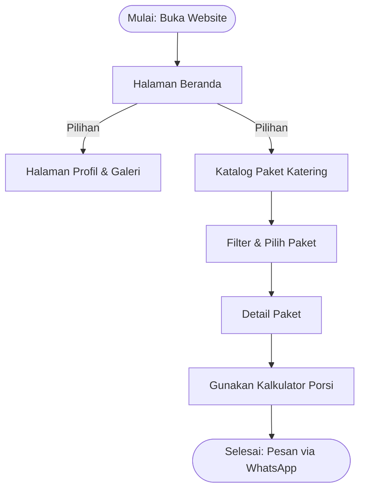
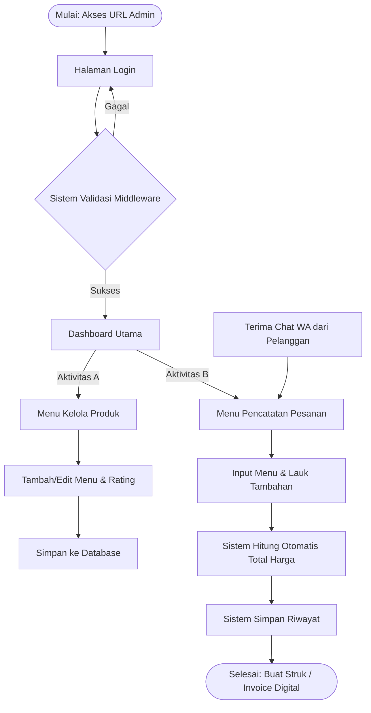

<!-- Context Anchor & Monorepo Topology -->
> **Scope:** Monorepo Architecture · **Monorepo Root:** `../`
>
> [Global Business Context](./project-context.md) · [Root Readme](../README.md) · [Frontend Architecture](../frontend/docs/architecture.md) · [Backend Architecture](../backend/docs/architecture.md) · [Backend API Specs](../backend/docs/api-collection.md)

# Architecture — Catering Nusantara

> This document explains the sitemap structure, userflow, and database schema for the Catering Nusantara project (Dapur Bunda Catering). It is written so that both developers and AI coding agents (OpenCode) have full context before writing code.

---

## 0. Monorepo Topology

Single repository, two applications, one shared database contract:

```
umkm-catering-system/
├── frontend/                       # User-facing SPA (React + Vite)
│   ├── src/                        # components, pages, router, store, services, api, hooks
│   ├── docs/architecture.md        # frontend component tree & state plan
│   └── docs/design.md              # design tokens (Suasana palette) — single design spec
├── backend/                        # Core business logic + API provider (Laravel)
│   ├── app/                        # Controllers, Requests, Resources, Services, Models
│   ├── routes/api.php              # REST routes (ground truth for the API)
│   ├── docs/api-collection.md      # API contract — single source of truth for schemas
│   └── docs/database.md            # Neon PostgreSQL schema & business rules
├── docs/                           # Root documentation & business context
│   ├── project-context.md          # Business "brain" — who, what, why, how
│   └── architecture.md             # This file — sitemap, userflow, ERD
└── assets/                         # Product photography (shared source of truth)
```

**How the two communicate:**

- `frontend/` → **REST** → `backend/`: the SPA calls `http://localhost:8000/api/v1/*` (via Ky, `src/api/client.ts`).
- **Auth:** Sanctum Bearer tokens — `POST /api/v1/auth/login` issues a token; the frontend sends `Authorization: Bearer <token>`; 401 clears the session.
- **Contract:** all endpoints/payloads/responses are defined once in `../backend/docs/api-collection.md` (backed by `backend/openapi.json` + `docs/api/bruno/`). The frontend references it — nothing is duplicated.
- **Local dev:** Vite `:5173` ↔ Laravel `:8000`; CORS allows `FRONTEND_URL` (set it to `http://localhost:5173` in `backend/.env`).
- **Data ownership:** `backend/` owns the database (Neon PostgreSQL) and all business rules (`total_harga`, `nomor_struk`, snapshots). The frontend is a thin, stateless consumer.

---

## 1. Architecture Overview

The system consists of two surfaces sharing a single database:

- **Public Site** — read-only access to `paket` and `galeri`, no authentication; its primary goal is conversion to a WhatsApp chat.
- **Admin CMS + Mini POS** — behind authentication middleware; the only surface that writes to `pesanan`.

The database schema (V3) is **structurally unchanged** in this revision — still 4 core tables (`users`, `paket`, `galeri`, `pesanan`). What this revision adds is **expanded public-page coverage** (based on the "Website Menu Structure" sheet) and the **front-end/back-end tech stack**, not new tables. This is noted explicitly here so AI agents do not assume new migrations need to be created without further instruction.

---

## 2. Sitemap & Page Priorities

Taken directly from the client's data (the "Website Menu Structure" sheet):

| # | Page | Sub-menu | Main Content | Data Source | Priority |
|---|---|---|---|---|---|
| 1 | Home | – | Banner + tagline, best-sellers, highlights summary, testimonials, CTA | Business Profile, Product Data | **Required** |
| 2 | About Us | – | Business history, vision & mission, value proposition, kitchen/team photos | Business Profile | **Required** |
| 3 | Catering Packages | Filter: Package Category, Event Category, Price Range | Grid/cards of all packages, filterable | Product Data | **Required** |
| 3.1 | Package Detail | – | Large photo, price per portion, main & add-on menus, min. order, WhatsApp CTA | Product Data | **Required** |
| 4 | Event Gallery | – | Documentation photos of previous events | Business Profile | Optional |
| 5 | Testimonials | – | Customer reviews + star ratings | Business Profile | Optional |
| 6 | How to Order | – | Flow: order → WhatsApp chat → confirmation → down payment → H-1 reconfirmation | Website Requirements | **Required** |
| 7 | Contact | – | Address, phone/WhatsApp, email, social media, location map, contact form | Business Profile | **Required** |
| 8 | FAQ | – | Common questions (min. order, special menu requests, delivery area, H- booking) | Website Requirements | Optional |
| 9 | Dashboard (Admin) | – | Total menus, total categories, side-dish summary | System (aggregate of `paket`) | Optional (treated as required for a working POS) |
| 10 | Login (Admin) | – | Authentication middleware | System (`users`) | Optional (technically required) |
| 11 | Manage Product Data | Full CRUD | Add/update/delete menus, manage package ratings | `paket` | Optional (technically required) |
| 12 | Order Recording & Calculation (Admin) | Calculate package + side-dish totals | Input order → automatic calculation → receipt → history | `pesanan` | Optional (technically required) |

> Note: pages 9–12 are marked "Optional" by the client in the spreadsheet, but architecturally they are the very foundation of the Mini POS that is the main selling point of the proposal — treat them as **required for the admin MVP**, not nice-to-have.

**Pages new in this revision compared to the previous one:** About Us, How to Order, Contact (with map), and FAQ now explicitly appear as separate public pages — previously they were only implied in the "Home → Catalog → Detail → Calculator → WhatsApp" flow.

---

## 3. Userflow

### 3.1 Customer Flow (Role 1)



Implementation note: the source diagram (`UMKM_Userflow.mmd`) does not yet show separate nodes for About Us, How to Order, Contact, and FAQ — however all four **must exist as static/informational pages** accessible from the main navigation, outside the linear conversion path above. Do not remove the core conversion path (Catalog → Detail → Calculator → WhatsApp) in favor of adding these pages; the two coexist.

### 3.2 Admin Flow (Role 2)



The critical transition remains the same as the previous version: the output of the customer flow (a WhatsApp message with package details and estimated price) becomes the **manual input** to Activity B on the admin side. The system does not replace WhatsApp as the sales channel — it eliminates the manual arithmetic and record-keeping around that channel.

---

## 4. Database Schema (ERD)

No new tables in this revision. The schema remains:

```dbml
Table users {
  id int [pk, increment]
  nama varchar [not null]
  email varchar [unique, not null]
  password varchar [not null]
  role varchar [default: 'admin']
  created_at timestamp
  updated_at timestamp
}

Table paket {
  id int [pk, increment]
  nama_paket varchar [not null]
  kategori_paket varchar [not null]       // Nasi Box, Prasmanan, Snack, Tumpeng
  kategori_acara varchar                   // Pernikahan, Kantor, Ulang Tahun, Arisan, Umum
  menu_utama json
  menu_tambahan json
  fasilitas_termasuk json
  catatan_alergen text
  jenis_kemasan varchar
  min_order int [default: 1]
  harga_per_porsi decimal(12,2) [not null]
  kapasitas_produksi int
  deskripsi text
  gambar varchar
  is_best_seller boolean [default: false]
  created_at timestamp
  updated_at timestamp
}

Table galeri {
  id int [pk, increment]
  nama_acara varchar [not null]
  deskripsi_acara text
  gambar_acara varchar [not null]
  tanggal_acara date
  created_at timestamp
  updated_at timestamp
}

Table pesanan {
  id int [pk, increment]
  nomor_struk varchar [unique, not null]   // STR-YYYYMMDD-XXXX
  nama_pemesan varchar [not null]
  no_telepon varchar [not null]
  paket_id int [ref: > paket.id, not null]
  jumlah_paket int [not null]
  harga_paket_satuan decimal(12,2) [not null]  // snapshot harga saat order dibuat
  detail_tambahan json
  biaya_tambahan decimal(12,2) [default: 0]
  catatan text
  total_harga decimal(12,2) [not null]
  status_pesanan varchar [default: 'pending']
  created_at timestamp
  updated_at timestamp
}
```

### 4.1 Validation Against the Client's Real Data

The client's real product data (the "Product Data" sheet) confirms this schema is flexible enough without changes:

- Price range per portion: Rp18.000 (Snack Box) up to Rp250.000 per 10-portion package (Tumpeng Mini) — the `harga_per_porsi` column as `decimal(12,2)` handles this without issue. **Special attention:** the Tumpeng Mini package is priced per package (10 portions), not per individual portion — ensure the `harga_per_porsi` column stores the quotient (Rp25.000/portion), and let `min_order` (10) carry the "per-package" meaning. Do not store the raw Rp250.000 figure as `harga_per_porsi`, because it would break the `total_harga` calculation in `pesanan`.
- Category variety (Nasi Box, Prasmanan, Snack, Tumpeng) and event-category variety (Pernikahan, Kantor, Ulang Tahun, Arisan, Umum) — already covered by `kategori_paket` and `kategori_acara` as free-form strings, sufficient for filtering.
- Production capacity varies (20 packages up to 1000 portions) — the `kapasitas_produksi` column already exists; use it for stock/capacity validation when the admin accepts large orders.

### 4.2 JSON Arrays vs. Junction Tables (still in effect)

The decision to store `menu_utama`, `menu_tambahan`, `fasilitas_termasuk`, and `detail_tambahan` as JSON — instead of junction tables — remains the right decision at this UMKM's scale:

| Criterion | Junction Table | JSON Column (used) |
|---|---|---|
| Catalog query complexity | Many joins per package card | One row, no joins |
| Write complexity when admin edits | Multi-table transaction | Single `UPDATE` |
| Schema flexibility | Migration needed for new attributes | Just add a new key |
| Cross-package query needs | Not relevant in this user flow | Not needed at all |

There is no real need for cross-package queries (e.g. "find all packages containing Rendang") in any sitemap — full normalization would be over-engineering for this case.

### 4.3 Potential Additional Tables (Optional, Not Implemented)

Two new pages in the sitemap — **Testimonials** and **FAQ** — are currently sourced from the "Business Profile"/"Website Requirements" sheets as static content, not from database tables. If the client later wants to manage testimonials/FAQ themselves through the admin (instead of hardcoding in the frontend), consider two lightweight tables `testimoni` and `faq` — **however these are outside the scope of the current revision** and must not be created without explicit confirmation from the team/client.

---

## 5. Data → Page Mapping

| Page | Backed by | Type |
|---|---|---|
| Home, Catering Packages, Package Detail | `paket` table | Dynamic (DB) |
| Event Gallery | `galeri` table | Dynamic (DB) |
| About Us, Testimonials, Contact | "Business Profile" sheet | Static/content (hardcoded or lightweight CMS, not relational DB) |
| How to Order, FAQ | "Website Requirements" sheet | Static/content |
| Dashboard, Manage Products, Order Recording | `paket`, `pesanan`, `users` tables | Dynamic (DB, behind auth) |
