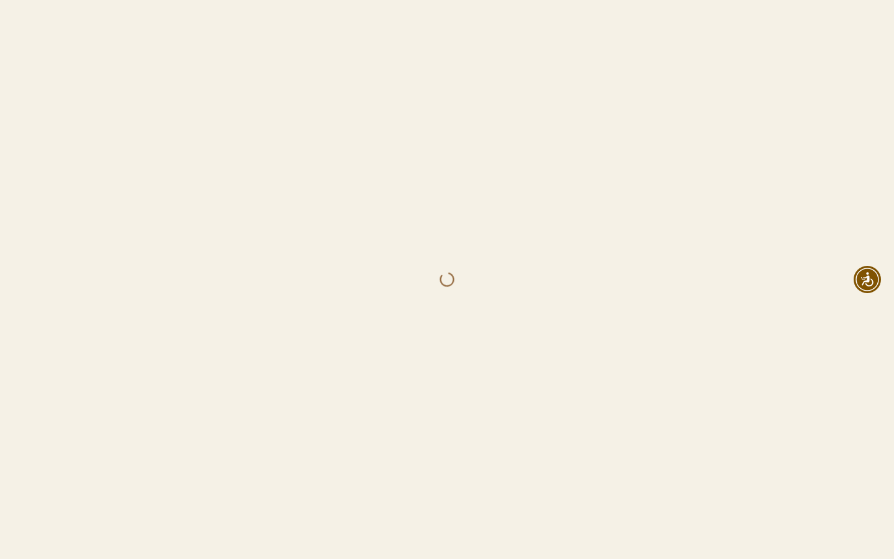
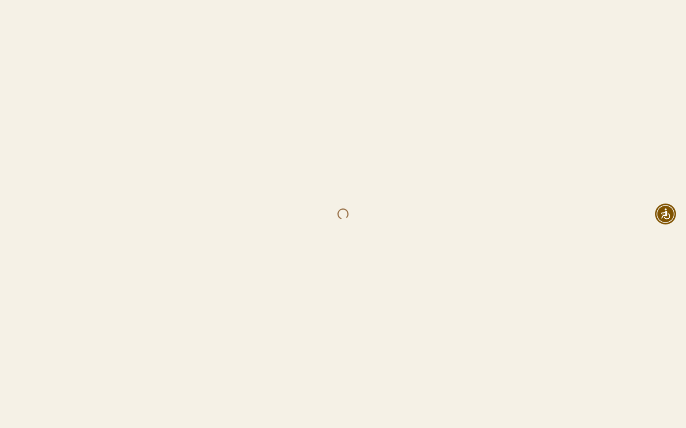
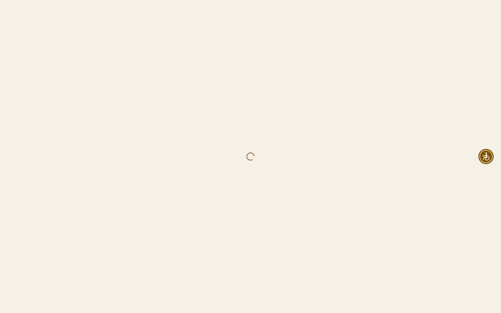
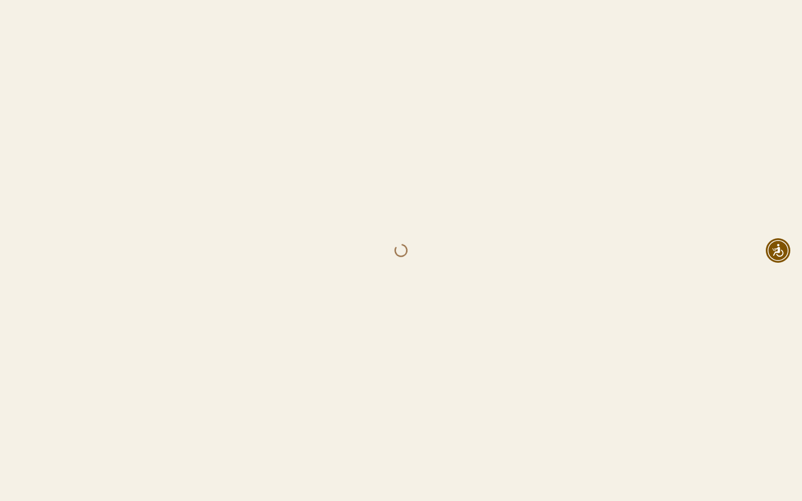

# Animation Reference

> Cinematic motion design extracted from live DOM. Follow these specs exactly to recreate the experience.

## Motion Technology Stack

| Library | Type | Notes |
|---------|------|-------|
| **Web Animations API (1 active)** | animation |  |

## Scroll Journey

The page is **900px** tall. Each frame below shows what the user sees at that scroll depth.

> **Use these screenshots to understand WHAT animates, WHEN it animates, and HOW it moves.**

### 0% — Top / Hero
Scroll position: 0px



### 17% — Opening Section
Scroll position: 0px


### 33% — First Feature Section
Scroll position: 0px


### 50% — Mid-Page
Scroll position: 0px



### 67% — Lower Content
Scroll position: 0px



### 83% — Near Footer
Scroll position: 0px


### 100% — Bottom / Footer
Scroll position: 0px



## CSS Keyframes (10 extracted)

### `@keyframes reveal`

Duration: `0.4s` · Easing: `ease-in-out` · Delay: `0s` · Iteration: `1` · Fill: `forwards`

Used by: `::view-transition-new(root)`

```css
@keyframes reveal {
  0% {
    clip-path: circle(0% at var(--x,50%)var(--y,50%));
    opacity: 0.7;
  }
  100% {
    clip-path: circle(150% at var(--x,50%)var(--y,50%));
    opacity: 1;
  }
}
```

> Opacity fade · Clip-path reveal

### `@keyframes spin`

```css
@keyframes spin {
  100% {
    transform: rotate(360deg);
  }
}
```

> Transform/motion animation

### `@keyframes ping`

```css
@keyframes ping {
  75%, 100% {
    opacity: 0;
    transform: scale(2);
  }
}
```

> Fade + motion enter animation

### `@keyframes pulse`

```css
@keyframes pulse {
  50% {
    opacity: 0.5;
  }
}
```

> Opacity fade

### `@keyframes enter`

```css
@keyframes enter {
  0% {
    opacity: var(--tw-enter-opacity,1);
    transform: translate3d(var(--tw-enter-translate-x,0),var(--tw-enter-translate-y,0),0)scale3d(var(--tw-enter-scale,1),var(--tw-enter-scale,1),var(--tw-enter-scale,1))rotate(var(--tw-enter-rotate,0));
    filter: blur(var(--tw-enter-blur,0));
  }
}
```

> Fade + motion enter animation · Filter effect (blur/brightness)

### `@keyframes exit`

```css
@keyframes exit {
  100% {
    opacity: var(--tw-exit-opacity,1);
    transform: translate3d(var(--tw-exit-translate-x,0),var(--tw-exit-translate-y,0),0)scale3d(var(--tw-exit-scale,1),var(--tw-exit-scale,1),var(--tw-exit-scale,1))rotate(var(--tw-exit-rotate,0));
    filter: blur(var(--tw-exit-blur,0));
  }
}
```

> Fade + motion enter animation · Filter effect (blur/brightness)

### `@keyframes infiniteScroll`

```css
@keyframes infiniteScroll {
  0% {
    transform: translate(0px);
  }
  100% {
    transform: translate(-100%);
  }
}
```

> Transform/motion animation

### `@keyframes infiniteScrollRigth`

```css
@keyframes infiniteScrollRigth {
  0% {
    transform: translate(-100%);
  }
  100% {
    transform: translate(0px);
  }
}
```

> Transform/motion animation

### `@keyframes songketScroll`

```css
@keyframes songketScroll {
  0% {
    background-position-x: 0%;
    background-position-y: center;
  }
  100% {
    background-position-x: -100%;
    background-position-y: center;
  }
}
```

> Background color/gradient shift · Background position (shimmer/scroll)

### `@keyframes songketScrollRight`

```css
@keyframes songketScrollRight {
  0% {
    background-position-x: -100%;
    background-position-y: center;
  }
  100% {
    background-position-x: 0%;
    background-position-y: center;
  }
}
```

> Background color/gradient shift · Background position (shimmer/scroll)

## Motion Tokens (CSS Variables)

### Duration Tokens

```css
--default-transition-duration: .15s;
```

### Easing Tokens

```css
--default-transition-timing-function: cubic-bezier(.4,0,.2,1);
--ease-out: cubic-bezier(0,0,.2,1);
--ease-in-out: cubic-bezier(.4,0,.2,1);
```

### Delay Tokens

```css
--tw-animation-delay: 0s;
```

### Animation Tokens

```css
--tw-animation-iteration-count: 1;
--tw-animation-direction: normal;
--tw-animation-fill-mode: none;
```

## How to Recreate This Motion Design

### Step 1 — Install Dependencies

```bash
```

### Step 2 — Scroll-Reveal Pattern

Elements that animate into view follow this pattern:

```css
/* Initial hidden state */
.reveal {
  opacity: 0;
  transform: translateY(40px);
  transition: opacity .15s cubic-bezier(.4,0,.2,1),
              transform .15s cubic-bezier(.4,0,.2,1);
}
.reveal.visible {
  opacity: 1;
  transform: translateY(0);
}
```

### Step 3 — Key Motion Principles

- **Duration scale:** `.15s` — use these values, never invent new durations
- **Always add** `@media (prefers-reduced-motion: reduce) { * { animation-duration: 0.01ms !important; transition-duration: 0.01ms !important; } }`

### Step 4 — Scroll Journey Reference

Match what happens at each scroll position:

- **0%** (`0px`) → `screens/scroll/scroll-000.png`
- **17%** (`0px`) → `screens/scroll/scroll-017.png`
- **33%** (`0px`) → `screens/scroll/scroll-033.png`
- **50%** (`0px`) → `screens/scroll/scroll-050.png`
- **67%** (`0px`) → `screens/scroll/scroll-067.png`
- **83%** (`0px`) → `screens/scroll/scroll-083.png`
- **100%** (`0px`) → `screens/scroll/scroll-100.png`

